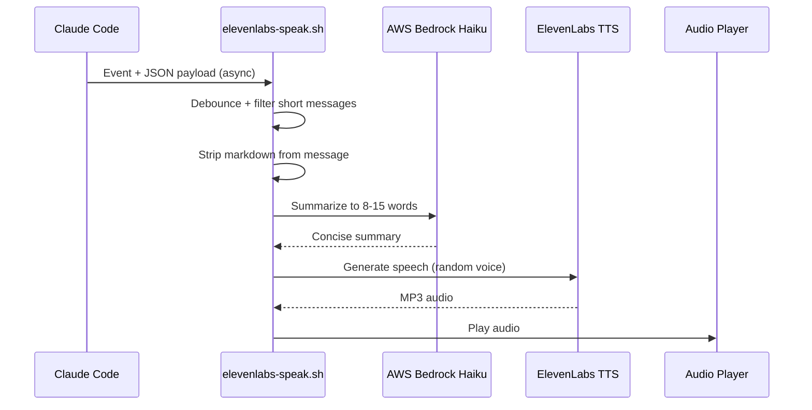

# claude-code-audio-hooks

Audio feedback hooks for [Claude Code](https://claude.ai/code) — hear what Claude
did after every task completion.

Uses **AWS Bedrock Haiku** to summarize what was done into a brief announcement,
then **ElevenLabs** text-to-speech to speak it aloud with a randomly selected voice
from a pool of 23 (male, female, neutral).

## What It Does

| Hook | Trigger | Action |
| --- | --- | --- |
| **Stop** | Any response > 100 chars | Summarize + speak what was done |
| **TaskCompleted** | A tracked task finishes | Summarize + speak (always) |

Short responses stay silent to avoid noise.

### Example

You ask Claude to refactor a module. When it finishes, you hear:

> *"Authentication module refactored to use JWT tokens."*

— spoken by a randomly selected voice in a sci-fi ship computer style.

## Architecture



See [docs/architecture.md](docs/architecture.md) for detailed flow diagrams,
debounce mechanism, and payload schemas.

## Prerequisites

- **macOS** or **Linux** (with PulseAudio or ALSA)
- **AWS CLI v2** with credentials configured
- **AWS Bedrock** access with Claude Haiku enabled ([setup guide](docs/bedrock-setup.md))
- **ElevenLabs** account with API key ([setup guide](docs/elevenlabs-setup.md))
- **jq** (`brew install jq` / `apt install jq`)
- **curl**

## Quick Start

```bash
git clone https://github.com/gamaware/claude-code-audio-hooks.git
cd claude-code-audio-hooks

# Run the installer
./install.sh

# Set your keys in ~/.claude/settings.json
# Merge config/settings-snippet.json into ~/.claude/settings.json
# Restart Claude Code

# Verify everything works
./test.sh
```

## Manual Setup

### 1. Copy the hook

```bash
mkdir -p ~/.claude/hooks
cp hooks/elevenlabs-speak.sh ~/.claude/hooks/
chmod +x ~/.claude/hooks/elevenlabs-speak.sh
```

### 2. Configure settings.json

Merge into your `~/.claude/settings.json`:

```json
{
  "env": {
    "ELEVENLABS_API_KEY": "your-elevenlabs-api-key",
    "AWS_PROFILE": "your-aws-profile",
    "AWS_REGION": "us-east-1"
  },
  "hooks": {
    "Stop": [
      {
        "hooks": [
          {
            "type": "command",
            "command": "bash ~/.claude/hooks/elevenlabs-speak.sh",
            "async": true
          }
        ]
      }
    ],
    "TaskCompleted": [
      {
        "hooks": [
          {
            "type": "command",
            "command": "bash ~/.claude/hooks/elevenlabs-speak.sh",
            "async": true
          }
        ]
      }
    ]
  }
}
```

### 3. Set up prerequisites

- [AWS Bedrock Setup](docs/bedrock-setup.md) — IAM policy, model access, credentials
- [ElevenLabs Setup](docs/elevenlabs-setup.md) — account, API key, voice selection

### 4. Restart and verify

```bash
./test.sh
```

## Configuration

| Variable | Default | Description |
| --- | --- | --- |
| `ELEVENLABS_API_KEY` | (required) | ElevenLabs API key |
| `AWS_PROFILE` | (default chain) | AWS CLI profile for Bedrock |
| `AWS_REGION` | `us-east-1` | AWS region for Bedrock |
| `BEDROCK_MODEL_ID` | `us.anthropic.claude-haiku-4-5-20251001-v1:0` | Bedrock model for summarization |
| `TTS_MODEL` | `eleven_turbo_v2_5` | ElevenLabs TTS model |
| `VOICE_IDS` | (all 23 voices) | Comma-separated voice IDs to use |
| `STOP_MIN_MESSAGE_LENGTH` | `100` | Min message length (chars) to trigger on Stop |

### Custom Voice Selection

```json
{
  "env": {
    "VOICE_IDS": "EXAVITQu4vr4xnSDxMaL,hpp4J3VqNfWAUOO0d1Us"
  }
}
```

See [docs/elevenlabs-setup.md](docs/elevenlabs-setup.md) for the full voice catalog
with 23 voices across male, female, and neutral options.

## Cost

| Service | Per call | Monthly (200 tasks) |
| --- | --- | --- |
| AWS Bedrock Haiku | ~$0.0001 | ~$0.02 |
| ElevenLabs TTS | ~50 characters | Free (10K chars/month free tier) |

## Key Features

- **Debounce** — lockfile prevents duplicate announcements when Stop and TaskCompleted fire together
- **Smart filtering** — short responses (< 100 chars) stay silent
- **Markdown stripping** — removes code blocks, backticks, and formatting before summarizing
- **Voice rotation** — randomly selects from 23 voices (or your custom subset)
- **Cross-platform** — macOS (afplay), Linux (paplay/aplay)
- **Fully parameterized** — everything configurable via environment variables
- **Ship computer style** — concise, authoritative summaries with specific technical details

## Troubleshooting

| Issue | Cause | Fix |
| --- | --- | --- |
| No audio at all | Missing audio player | macOS has `afplay` built in; Linux: `apt install pulseaudio-utils` |
| Silence on all responses | `ELEVENLABS_API_KEY` not set | Add to settings.json env block |
| Silence on short responses | Expected behavior | Messages under 100 chars are silent on Stop |
| Duplicate announcements | Both hooks firing | Debounce lockfile handles this automatically |
| AWS auth error | Expired credentials | `aws sso login --profile your-profile` |
| ElevenLabs 429 | Free tier exhausted | Wait for monthly reset or upgrade |
| Slow audio (~5s delay) | Normal async latency | Bedrock + ElevenLabs + playback pipeline |

## Documentation

- [Architecture & Data Flow](docs/architecture.md) — Mermaid diagrams, payload schemas
- [AWS Bedrock Setup](docs/bedrock-setup.md) — IAM, model access, credentials
- [ElevenLabs Setup](docs/elevenlabs-setup.md) — account, API key, voices

## License

[MIT](LICENSE)
