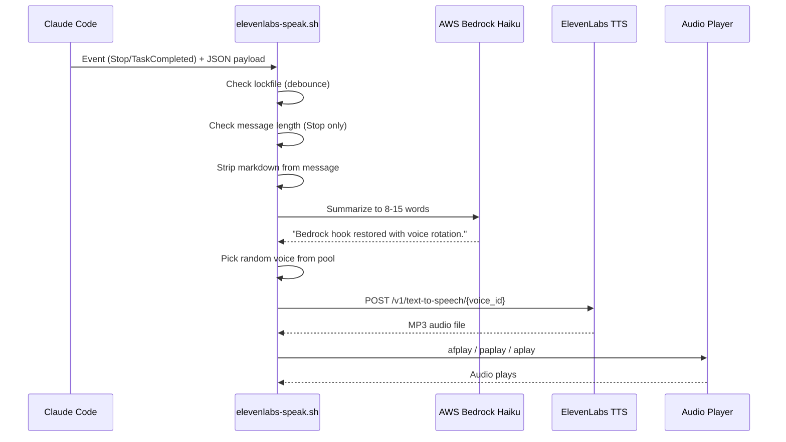
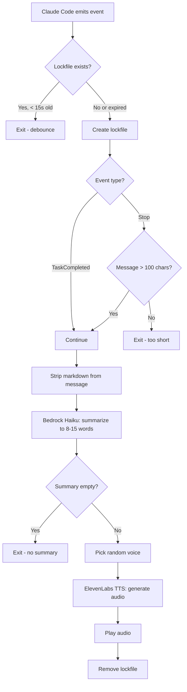
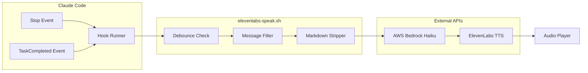
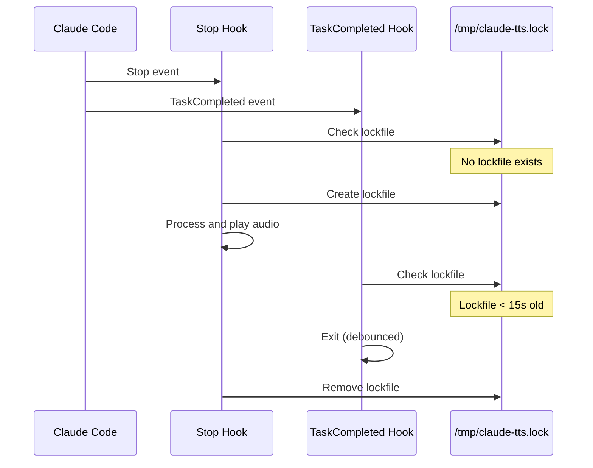

# Architecture

## How Claude Code Hooks Work

Claude Code emits events at key moments during a session. You can attach shell
commands to these events via `hooks` in `~/.claude/settings.json`. Each hook
receives a JSON payload on stdin with context about the event.

Hooks run **asynchronously** (`"async": true`), meaning they do not block Claude
Code from continuing to work.

## Data Flow

### Full Pipeline



### Decision Flow



### Component Overview



## Hook Payload Schemas

### Stop Payload

Received on every Claude Code response.

```json
{
  "cwd": "/current/working/directory",
  "hook_event_name": "Stop",
  "last_assistant_message": "Full text of Claude's last response...",
  "permission_mode": "default",
  "session_id": "uuid",
  "stop_hook_active": true,
  "transcript_path": "/path/to/session.jsonl"
}
```

### TaskCompleted Payload

Received when a tracked task is marked complete (e.g., during plan mode).

```json
{
  "cwd": "/current/working/directory",
  "hook_event_name": "TaskCompleted",
  "last_assistant_message": "Full text of Claude's last response...",
  "permission_mode": "default",
  "session_id": "uuid",
  "transcript_path": "/path/to/session.jsonl"
}
```

## Debounce Mechanism

When both `Stop` and `TaskCompleted` fire for the same response (common during
plan mode), the lockfile prevents duplicate announcements:



## Performance

```mermaid
gantt
    title Pipeline Latency (async, non-blocking)
    dateFormat X
    axisFormat %L ms

    section Processing
    JSON parsing + markdown strip : 0, 50
    section Bedrock
    Haiku summarization          : 50, 1500
    section ElevenLabs
    TTS generation               : 1500, 2500
    section Playback
    Audio output                 : 2500, 4500
```



| Step | Typical latency |
| --- | --- |
| Hook trigger + JSON parsing | < 50ms |
| Bedrock Haiku summarization | 500ms - 1.5s |
| ElevenLabs TTS generation | 500ms - 1s |
| Audio playback | 1 - 2s |
| **Total** | **2 - 4s** |

Since hooks run asynchronously, this does not block your next prompt.

## Available Hook Events

This project uses `Stop` and `TaskCompleted`. Other events you could extend to:

| Event | Potential use |
| --- | --- |
| `SessionStart` | Greeting announcement |
| `SessionEnd` | Farewell announcement |
| `Notification` | Speak notifications aloud |
| `SubagentStop` | Announce when a subagent finishes |

## Security Considerations

- API keys are stored in `~/.claude/settings.json` env block, not in scripts
- Scripts read keys from environment variables at runtime
- Only a truncated, markdown-stripped summary (max 400 chars) is sent to Bedrock
- ElevenLabs receives only the ~10 word summary, not the full conversation
- Temp files are cleaned up via `trap` on EXIT
- All API calls use HTTPS
